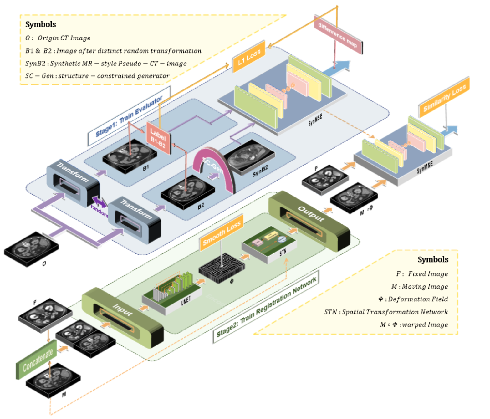

# SynMSE


📄 Paper: SynMSE: A multimodal similarity evaluator for complex distribution discrepancy in unsupervised deformable multimodal medical image registration

✍️ Authors: [Jingke Zhu] et al.

📍 Published in: Medical Image Analysis, 2025

🧱 Link: https://www.sciencedirect.com/science/article/pii/S1361841525001677

## Usage
1. You need to pre-train a CycleGAN model for distribution transfer and replace the path with your own generative model in trainer/cyclegan_syn.
2. Start visdom：
 ```
python -m visdom.server -p 8097
```
If other port parameters are used, you need to modify the port in yaml.

3. Train:
 ```
python main.py
```
You can train the evaluator, train the registration model, and test the registration model separately by modifying the code in main.py.
